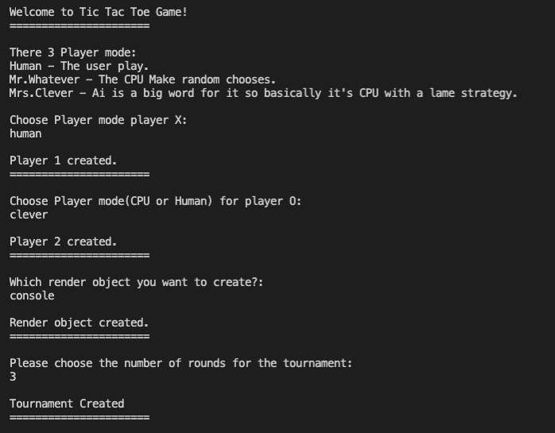
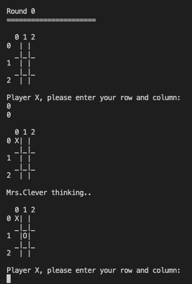

# TicTacTow Game
 
The project is a Tic Tac Toe game with CPU player 🤖.

## Table of contents
* [General info](#general-info)
* [Technologies](#technologies)
* [Features](#features)
* [Screenshots](#screenshots)
* [Setup](#setup)
* [Acknowledgements](#acknowledgements)

## General info
- Board size is 3X3.
- The player chooses where to mark his sign by entering coordinates of the board(x,y).
	
## Technologies
* java SE17
* java utilities library

## Features
- Player can choose 3 game modes:
  1. Human player VS another human player.
  2. Human player VS CPU
  3. CPU VS CPU

- Mr.Whatever, he just mark his sign randomly.(CPU)
- Mrs.Clever, a little bit smarter than Mr.Whatever, she has a basic algorithm for decision making.(CPU)

- 2 option for screen rendering:
  1. Void print - it just won't print anything on screen except the result of the tournament(it saves time if you put a cpu player against a cpu player).
  2. Console renderer - it's showing everything on screen without skipping.

## Screenshots
> The boot process of the tournament.

> Example of the game process.

## Setup
1. First download all the folders.
2. Run Tournament.java file in your java IDE.
3. Enjoy!

### Known issues
* Mrs.Clever is compatible for board size of 3X3 only, maybe in the future i will make her compatible with any board size and smarter.

## Acknowledgements
I would like to thank CampusIL and the team behind the "Object oriented programming" course!
> Link to the course home page [here](https://campus.gov.il/course/huji_acd_rfp4_huji_oop/)
